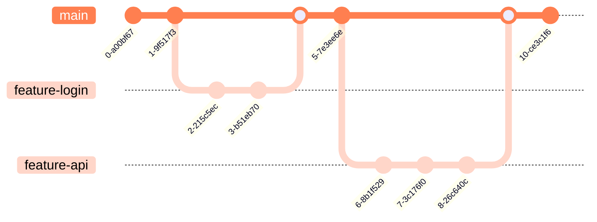

# Engineering Open Source Projects

<p>
  Anton Grishin (<a href="https://t.me/alchemmist"><span class="mono-text">@alchemmist</span></a>)
</p>

Introduction to the EOSP course.

<div class="abs-br m-6 text-xl"> 
  <a href="https://github.com/alchemmist/eosp" target="_blank" class="slidev-icon-btn">
    <carbon:logo-github />
  </a>
</div>

---
layout: center
---

# Table of contents

|                                                |                                                      |
| ---------------------------------------------- | ---------------------------------------------------- |
| <code style="color:#50C878">hello</code>       | Getting to know each other better.                   |
| <code style="color:#0096FF">open-source</code> | Diving into the World of OpenSource.                 |
| <code style="color:#FFBF00">course</code>      | Figure out what awaits us in the course.             |
| <code style="color:#FF69B4">practice</code>    | Come up with a name for the project together.        |
| <code style="color:#D22B2B">live-demo</code>   | Lay the foundation for the project together.         |
| <code style="color:#5D3FD3">api</code>         | Getting to know the GitHub API.                      |
| <code style="color:#FF7F50">github-flow</code> | How are Open Source development processes organized. |

---
layout: center
---

# Let's get acquainted<MarkerX color="#50C878" title="hello" />

What do you think false here?

<ul>
  <li v-click>I'm Anton. Study at 2nd course of SWE at Central University.</li>
  <li v-click><a href="https://github.com/alchemmist">Involved</a> in the development of 70+ repositories and have sent <span style="font-family: monospace">~</span>1600 commits.</li>
  <li v-click>I'm graduate of Yandex Lyceum golden certificate.</li>
  <li v-click>I used Linux as main operation system for last 3 years.</li>
  <li v-click><span v-mark.strike-through.red="9">I can type 120 words per minute on qwerty keyboard.</span></li>
  <li v-click>I used to be a professional volleyball player.</li>
  <li v-click>I am using only terminal for developing.</li>
  <li v-click>Author of blog: <a class="mono-text" href="https://alchemmist.xyz?utm_source=slides">alchemmist.xyz</a></li>
</ul>

---
layout: center
---

# Tell us about yourself<MarkerX color="#50C878" title="hello" />

---
layout: center
---

# What is Open Source<ri-open-source-fill /><MarkerX color="#0096FF" title="open-source" />

Source code of project is open to see for everyone.

<span v-click>Open to copy? Open to appropriate? Open to sell?</span>

---
layout: image-right
image: /assets/postgres-repo.png
background-position: left
shadow: true
---

## Postgres DBMS <span class="mono-text">(MIT/BSD)</span><MarkerX color="#0096FF" title="open-source" />

<ul>
<li v-click>Full access to the source code</li>
<li v-click>Use in commercial products</li>
<li v-click>Selling as part of your own product</li>
<li v-click>Closing your code on top of PostgreSQL</li>
<li v-click>Please, save the license and author name</li>
</ul>

---
layout: image-right
image: /assets/postgres-pro.png
background-position: left
shadow: true
---

## Postgres PRO <span class="mono-text">(EULA)</span><MarkerX color="#0096FF" title="open-source" />

<ul>
<li v-click>EULA — End User License Agreement</li>
<li v-click>Distributed for a money</li>
<li v-click>OpenCore model</li>
</ul>

---
layout: image-right
image: /assets/angularjs-repo.png
background-position: left
shadow: true
---

## Angular JS <span class="mono-text">(MIT)</span><MarkerX color="#0096FF" title="open-source" />

<ul>
<li v-click>Fully open (as Postgres)</li>
<li v-click>Repo is exist, but deprecated</li>
<li v-click>No support</li>
<li v-click>No improves</li>
<li v-click>No bug fixes</li>
<li v-click>The reason is switched on TypeScript</li>
</ul>

---
layout: image-right
image: /assets/linux-repo.png
background-position: left
shadow: true
---

# Linux kernel <span class="mono-text">(GPLv2)</span><MarkerX color="#0096FF" title="open-source" />

<ul>
<li v-click>Full access to the source code</li>
<li v-click>Use in commercial products</li>
<li v-click>Forks must remain GPL if distributed: copyleft</li>
</ul>

---
layout: center
---

# OpenSource is the foundation of modern IT<MarkerX color="#0096FF" title="open-source" />

A space where technology is emerging.

---
layout: center
---

<Quote
  text="99% of Fortune 500 companies currently use open source software. <...> Over 56 million developers are contributing to open source projects. <...> Due to ever-rising workloads, the Linux
operating systems market is expected to grow at the rate of 7% a year, reaching
$9.7 billion by 2024."
  author="Pranay Ahlawat, Boston Consulting Group"
  source="Why You Need an Open Source Software Strategy"
  sourceUrl="https://web-assets.bcg.com/pdf-src/prod-live/open-source-software-strategy-benefits.pdf"
  year="April 2021"
  avatar="/assets/pranay-ahlawat.png"
  type="Article"
/>

---
layout: center
---

# The idea and goal of our project<MarkerX color="#FFBF00" title="course"/>

Course is totally practice-driven.

<ul>
<li v-click>Build a practical system to evaluate developer contributions based on GitHub activity</li>
<li v-click>Learn modular software design: <code>library</code> → <code>CLI</code> → <code>Telegram bot</code></li>
<li v-click>Practice real-world Open Source workflows: issues, pull requests, reviews and so on</li>
<li v-click>Focus on clean, maintainable, and testable code</li>
<li v-click>Experience CI/CD pipelines, releases, and deployment automation</li>
<li v-click>Document, setting and organize projects properly</li>
<li v-click>Develop skills to build slide deck and pitch project publicly</li>
</ul>

---
layout: center
---

# Two main problem cases<MarkerX color="#FFBF00" title="course"/>

<div style="display: flex; gap: 1rem;">
<Card v-click title="Profile analytics" mono-head color="#D70040">
  <ul>
    <li>HR wants quick insight into a developer’s activity without digging into GitHub manually</li>
    <li>Analyze the <b>entire GitHub profile</b>: all repositories, contributions, and activity history</li>
    <li>Understand which languages and technologies a developer uses</li>
    <li>Track contributions across repositories: commits, pull requests, issues</li>
    <li>Generate a concise profile summary for recruitment decisions</li>
  </ul>
</Card>

<Card v-click title="Leader board of team" mono-head color="#D70040">
  <ul>
    <li>Team leads want visibility into team productivity</li>
    <li>Analyze <b>contributions within a single repository</b> to compare team members fairly</li>
    <li>Track per-developer metrics: code quality, review participation, issue resolution</li>
    <li>Identify who is actively contributing and who may need support or guidance</li>
    <li>Provide fair, data-driven insights to improve collaboration and team performance</li>
  </ul>
</Card>
</div>

---
layout: default
---

# Three setups, three projects<MarkerX color="#FFBF00" title="course"/>

<div style="display: flex; gap: 1rem;">
<Card v-click title="Python library" mono-head color="#228B22">
  <ul>
    <li>Calculate developer contribution metrics from GitHub data</li>
    <li>Provide reusable, modular functions for metrics computation</li>
    <li>Include comprehensive unit tests and follow TDD approach</li>
    <li>Serve as the core foundation for CLI and bot integrations</li>
    <li>Support easy extension and maintainability</li>
  </ul>
</Card>

<Card v-click title="CLI" mono-head color="#228B22">
  <ul>
    <li>Provide command-line access to library metrics</li>
    <li>Support multiple commands, flags, and options</li>
    <li>Enable fetching, displaying, and exporting data conveniently</li>
    <li>Handle errors gracefully and show meaningful messages</li>
    <li>Integrate with CI/CD for automated releases</li>
  </ul>
</Card>

<Card v-click title="Telegram bot" mono-head color="#228B22">
  <ul>
    <li>Provide easy access to metrics via Telegram interface</li>
    <li>Interact with users, handle commands and queries</li>
    <li>Securely manage secrets and API tokens</li>
    <li>Fetch data from library and format it for user-friendly display</li>
    <li>Support notifications, updates, and automated alerts</li>
  </ul>
</Card>
</div>

---
layout: center
---

# How should this course be perceived?<MarkerX color="#FFBF00" title="course"/>

Motivation and mindset.

---
layout: center
---

<Quote
  text="It's a bit sad to think of all the high school kids turning their backs on building treehouses and sitting in class dutifully learning about Darwin or Newton to pass some exam, when the work that made Darwin and Newton famous was actually closer in spirit to building treehouses than studying for exams."
  author="Paul Graham"
  source="A Project of One’s Own"
  sourceUrl="https://paulgraham.com/own.html"
  year="June 2021"
  avatar="/assets/paul-graham.png"
/>

---
layout: center
---

# It's time to come up with a name! <MarkerX color="#FF69B4" title="practice" />

Go to Figma [board](https://www.figma.com/board/or8qJTXL7iF7vnPMqwgaeL/eosp-brainstorm?node-id=0-1&t=wzrFKYsRS5GCFwnN-1)!

---
layout: center
---

# Let's make first step <MarkerX color="#D22B2B" title="live-demo" />

Creating GitHub organization and repo.

---
layout: center
---

# Introduction to GitHub API.<MarkerX color="#5d3fd3" title="api" />

[`gh api /octocat`](https://api.github.com/octocat)

---
layout: center
---

# GitHub API is just HTTP<MarkerX color="#5d3fd3" title="api" />

Any tool that can send HTTP requests can work with GitHub API.

<ul>
  <li v-click><code>gh</code> — convenient wrapper around the API</li>
  <li v-click><code>curl</code> — raw HTTP from terminal</li>
  <li v-click><code>Python</code> — programmatic access for automation and logic</li>
</ul>

---
layout: two-cols-header
---

# Official `gh` cli<MarkerX color="#5d3fd3" title="api" />

The cli utility for using all github functionality from terminal.

::left::

<div v-click>
Install into your shell:

```sh
# Mac:
brew install gh

# Windows:
winget install --id GitHub.cli

# Arch:
sudo pacman -S github-cli
```

</div>

<div v-click>
And try something, for example:

```sh
gh api /users/alchemmist
```

</div>

::right::

<div v-click="3">
As result:

````md magic-move {lines: true}
```json {*|3|5|9-12|13|14-15|*}
{
  "login": "alchemmist",
  "avatar_url": "https://avatars.githubusercontent.com/u/104511335?v=4",
  "html_url": "https://github.com/alchemmist",
  "followers_url": "https://api.github.com/users/alchemmist/followers",
  "subscriptions_url": "https://api.github.com/users/alchemmist/subscriptions",
  "repos_url": "https://api.github.com/users/alchemmist/repos",
  "type": "User",
  "name": "Anton Grishin",
  "blog": "alchemmist.xyz?utm_source=github",
  "location": "Russia, Moscow",
  "email": "anton.ingrish@gmail.com",
  "followers": 18,
  "created_at": "2022-04-27T14:12:26Z",
  "updated_at": "2026-01-09T06:23:55Z",
  ...
}
```
````

</div>

---
layout: full
---

# More in [documentation](https://cli.github.com/manual/gh_api)<MarkerX color="#5d3fd3" title="api" />

<Image src="/assets/gh-cli-doc.png" />

---
layout: two-cols-header
---

# Using `curl` for GitHub API <MarkerX color="#5d3fd3" title="api" />

Raw HTTP requests from terminal.

::left::

<div v-click>

Send GET authenticated request:

```sh
curl -L \
  -H "Accept: application/vnd.github+json" \
  -H "Authorization: Bearer <TOKEN>" \
  -H "X-GitHub-Api-Version: 2022-11-28" \
  https://api.github.com/repos/alchemmist/eosp/stats/contributors
```

</div>

<div v-click>
According to the <a href="https://docs.github.com/en/rest/metrics/statistics?apiVersion=2022-11-28#get-all-contributor-commit-activity">documentation</a>

- `w` — Start of the week, given as a [Unix timestamp](https://en.wikipedia.org/wiki/Unix_time).
- `a` — Number of additions
- `d` — Number of deletions
- `c` — Number of commits
</div>

::right::

<div v-click="3">
As result:

````md magic-move {lines: true}
```json {*|2|4-7|13-16|*}
[{
    "total": 37,
    "weeks": [{
        "w": 1765670400,
        "a": 6477,
        "d": 0,
        "c": 1},
       {"w": 1768089600,
        "a": 0,
        "d": 0,
        "c": 0}, ...
    ],
    "author": {
      "login": "alchemmist",
      "id": 104511335,
      "node_id": "U_kgDOBjq3Zw",...
    }
}]
```
````

</div>

<p v-click="4" id="converted-date" class="absolute px-2 py-1 bg-blue top-22 right-45 opacity-90 color-white transform rotate-10">Sun Dec 14 2025</p>
<FancyArrow v-click="4" from="(700, 190)" to="[id=converted-date]@bottom" head-size="20" roughness="1" duration="800" delay="100" />

---
layout: full
---

# More in [documentation](https://cli.github.com/manual/gh_api)<MarkerX color="#5d3fd3" title="api" />

<Image src="/assets/github-api-doc.png" />

---
layout: two-cols-header
---

# Using GitHub API with Python<MarkerX color="#5d3fd3" title="api" />

Efficient, parallel, production-ready requests.

::left::

<div v-click>

Example with <code>httpx</code>:

```python
import asyncio, httpx


async def fetch_prs(username):
    url = f"https://api.github.com/search/issues?"\
          f"q=author:{username}+type:pr+created:>2025-01-01"
    async with httpx.AsyncClient() as client:
        resp = await client.get(
            url,
            headers={
                "Authorization": "Bearer <TOKEN>"
            },
        )
        data = resp.json()
        for pr in data["items"]:
            print(f"{pr['title']}\n\t-> {pr['html_url']}")


asyncio.run(fetch_prs("alchemmist"))
```

</div>

::right::

<div v-click>
As result:

```plaintext
Add alchemmist.xyz individual blog
	-> https://github.com/kilimchoi/engineering-blogs/pull/1201
Add alchemmist.xyz personal blog
	-> https://github.com/learn-anything/blogs/pull/21
Add alchemmist.xyz blog
	-> https://github.com/logancyang/awesome-personal-websites/pull/1
Add alchemmist.xyz blog
	-> https://github.com/jkup/awesome-personal-blogs/pull/173
Add @alchemmist_blog to personal blogs section
	-> https://github.com/goq/telegram-list/pull/992
Add @alchemmist_blog to personal blogs section
	-> https://github.com/alchemmist/telegram-list/pull/1
Add a "quiet" exit (#104)
	-> https://github.com/cqfn/aibolit/pull/818
```

</div>

<span v-click style="color: rgba(0, 0, 0, 0.5)" class="mono-text">\*GraphQL — a query language for APIs that lets you request exactly the data you need in a single query, without extra fields.</span>

---
layout: center
---

# GitHub API Limitations<MarkerX color="#5d3fd3" title="api" />

Understanding these limits is essential when building scalable, reliable systems for collecting GitHub data.

<ul>
  <li v-click>Rate limits: <b>5000 requests per hour</b> for authenticated users</li>
  <li v-click>Rate limits: <b>60 requests per hour</b> for unauthenticated users</li>
  <li v-click>Pagination: most endpoints return max <b>100 items per page</b>, need to handle paging</li>
  <li v-click>Private data requires proper authentication and scopes</li>
  <li v-click>GraphQL vs REST: some data easier via GraphQL, but query complexity may hit limits</li>
  <li v-click>API responses may be delayed or cached; real-time metrics may require retries</li>
  <li v-click>Some endpoints change over time; library must handle API versioning</li>
</ul>

---
layout: two-cols-header
gap: 50px
---

# Developing flows <MarkerX color="#FF7F50" title="github-flow" />

Two ways of coding.

::left::

<div v-click>

## Git Flow

A structured and process-heavy branching model designed for scheduled releases. It relies on long-lived branches and explicit release management, which makes it predictable but slower to adapt.

</div>

<div style="width: 300px" v-click>


</div>

::right::

<div v-click>

## GitHub Flow

A lightweight workflow optimized for continuous delivery and open source. The `main` branch is always deployable, and all changes flow through pull requests.

</div>

<div style="width: 340px" v-click >



</div>

<style scoped>
.two-cols-header {
  column-gap: 10cm !important;
}
</style>

---
layout: center
---

# Why GitHub Flow?<MarkerX color="#FF7F50" title="github-flow" />

<ul>
<li v-click>All changes go through <b>pull requests</b> → code review, CI/CD checks</li>
<li v-click>Encourages small, incremental updates rather than long-lived branches</li>
<li v-click>Clear separation: <code>main</code> branch is always deployable</li>
<li v-click>Integration with issues and project boards → planning and tracking in one place</li>
<li v-click>Transparency and collaboration: team members can comment, review, approve, or reject changes</li>
</ul>

---
layout: center
---

# Key Entities in GitHub Flow<MarkerX color="#FF7F50" title="github-flow" />

<div style="display: grid; grid-template-columns: repeat(3, 1fr); grid-auto-rows: 1fr; gap: 1rem;">

<Card v-click title="Issue" mono-head color="#FF7F50">
Describes a bug, feature, task, or question. Starting point for development.
</Card>

<Card v-click title="Branch" mono-head color="#FF7F50">
Isolated workspace for a specific feature or fix.
</Card>

<Card v-click title="Commit" mono-head color="#FF7F50">
Individual changes tracked in Git history.
</Card>

<Card v-click title="Pull Request (PR)" mono-head color="#FF7F50">
Proposes changes from a branch into main. Facilitates review and discussion.
</Card>

<Card v-click title="Code Review" mono-head color="#FF7F50">
Teammates review PRs to ensure quality and maintainability.
</Card>

<Card v-click title="CI/CD Checks" mono-head color="#FF7F50">
Automated tests, linting, build, and deployment pipelines.
</Card>

<Card v-click title="Merge" mono-head color="#FF7F50">
Approved PR is merged into main and usually triggers deployment.
</Card>

</div>

---
layout: two-cols
---

<style scoped>
.col-right {
  display: flex;
  flex-direction: row-reverse;
}
</style>

# GitHub Flow in Action<MarkerX color="#FF7F50" title="github-flow" />

Visual representation of the workflow:

<ol>
  <li v-click>Developer identifies a bug or feature → <b>creates an issue</b></li>
  <li v-click>Creates a branch from <code>main</code> for the issue</li>
  <li v-click>Makes <b>commits</b> locally and pushes to GitHub</li>
  <li v-click>Opens a <b>pull request</b> linking to the issue</li>
  <li v-click>Team conducts <b>code review</b> and automated **CI/CD checks**</li>
  <li v-click>After approval, PR is merged into <code>main</code></li>
  <li v-click>Deployment triggers automatically (if CI/CD is configured)</li>
</ol>

::right::

<div v-click="1" style="width: 220px;">


</div>

---
layout: center
---

# Best Practices in GitHub Flow<MarkerX color="#FF7F50" title="github-flow" />

<ul>
<li v-click>Keep branches <b>short-lived</b> → frequent integration reduces conflicts</li>
<li v-click>Write <b>descriptive commits</b> → history becomes meaningful</li>
<li v-click>Reference issues in PRs → link work to context</li>
<li v-click>Use <b>templates</b> for PRs and issues → standardize workflow</li>
<li v-click>Automate as much as possible → CI/CD, tests, linters, code quality checks</li>
<li v-click>Encourage <b>review culture</b> → better code, knowledge sharing, accountability</li>
</ul>

---
layout: end
---
