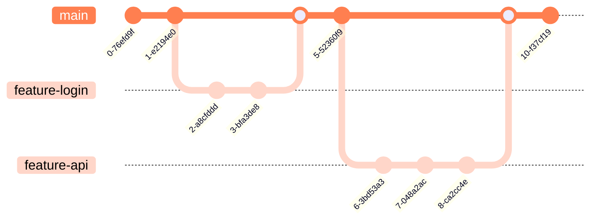

# Engineering Open Source Projects

<p>
  Anton Grishin (<a href="https://t.me/alchemmist"><span class="mono-text">@alchemmist</span></a>)
</p>

Введение в курс EOSP.

<div class="abs-br m-6 text-xl"> 
  <a href="https://github.com/alchemmist/eosp" target="_blank" class="slidev-icon-btn">
    <carbon:logo-github />
  </a>
</div>

---
layout: center
---

# Содержание

|                                                |                                                   |
| ---------------------------------------------- | ------------------------------------------------- |
| <code style="color:#50C878">hello</code>       | Лучше познакомимся друг с другом.                 |
| <code style="color:#0096FF">open-source</code> | Погружаемся в мир OpenSource.                     |
| <code style="color:#FFBF00">course</code>      | Разберём, что нас ждёт на курсе.                  |
| <code style="color:#FF69B4">practice</code>    | Придумаем название для проекта вместе.            |
| <code style="color:#D22B2B">live-demo</code>   | Закладываем основу проекта вместе.                |
| <code style="color:#5D3FD3">api</code>         | Познакомимся с GitHub API.                        |
| <code style="color:#FF7F50">github-flow</code> | Как организованы процессы разработки Open Source. |

---
layout: center
---

# Давайте познакомимся<MarkerX color="#50C878" title="hello" />

Что здесь неверно?

<ul>
  <li v-click>Я Антон. Учусь на 2 курсе SWE в Central University.</li>
  <li v-click><a href="https://github.com/alchemmist">Участвовал</a> в разработке 70+ репозиториев и сделал <span style="font-family: monospace">~</span>1600 коммитов.</li>
  <li v-click>Я выпускник Яндекс Лицея с золотым сертификатом.</li>
  <li v-click>Использую Linux как основную операционную систему последние 3 года.</li>
  <li v-click><span v-mark.strike-through.red="9">Я могу печатать 120 слов в минуту на клавиатуре qwerty.</span></li>
  <li v-click>Раньше был профессиональным волейболистом.</li>
  <li v-click>Использую только терминал для разработки.</li>
  <li v-click>Автор блога: <a class="mono-text" href="https://alchemmist.xyz?utm_source=slides">alchemmist.xyz</a></li>
</ul>

---
layout: center
---

# Расскажите о себе<MarkerX color="#50C878" title="hello" />

---
layout: center
---

# Что такое Open Source<ri-open-source-fill /><MarkerX color="#0096FF" title="open-source" />

Исходный код проекта открыт для всех.

<span v-click>Можно копировать? Можно использовать? Можно продавать?</span>

---
layout: image-right
image: /assets/postgres-repo.png
background-position: left
shadow: true
---

## Postgres DBMS <span class="mono-text">(MIT/BSD)</span><MarkerX color="#0096FF" title="open-source" />

<ul>
<li v-click>Полный доступ к исходному коду</li>
<li v-click>Использование в коммерческих продуктах</li>
<li v-click>Продажа как часть своего продукта</li>
<li v-click>Закрытие своего кода поверх PostgreSQL</li>
<li v-click>Сохраняйте лицензию и имя автора</li>
</ul>

---
layout: image-right
image: /assets/postgres-pro.png
background-position: left
shadow: true
---

## Postgres PRO <span class="mono-text">(EULA)</span><MarkerX color="#0096FF" title="open-source" />

<ul>
<li v-click>EULA — лицензионное соглашение с конечным пользователем</li>
<li v-click>Распространяется за деньги</li>
<li v-click>Модель OpenCore</li>
</ul>

---
layout: image-right
image: /assets/angularjs-repo.png
background-position: left
shadow: true
---

## Angular JS <span class="mono-text">(MIT)</span><MarkerX color="#0096FF" title="open-source" />

<ul>
<li v-click>Полностью открыт (как Postgres)</li>
<li v-click>Репозиторий существует, но устарел</li>
<li v-click>Нет поддержки</li>
<li v-click>Нет улучшений</li>
<li v-click>Нет исправлений ошибок</li>
<li v-click>Причина — переход на TypeScript</li>
</ul>

---
layout: image-right
image: /assets/linux-repo.png
background-position: left
shadow: true
---

# Ядро Linux <span class="mono-text">(GPLv2)</span><MarkerX color="#0096FF" title="open-source" />

<ul>
<li v-click>Полный доступ к исходному коду</li>
<li v-click>Использование в коммерческих продуктах</li>
<li v-click>Форки должны оставаться под GPL при распространении: копилефт</li>
</ul>

---
layout: center
---

# OpenSource — основа современной IT-индустрии<MarkerX color="#0096FF" title="open-source" />

Пространство, где появляются технологии.

---
layout: center
---

<Quote
  text="99% компаний из Fortune 500 используют открытое ПО. <...> Более 56 миллионов разработчиков вносят вклад в проекты Open Source. <...> Из-за растущей нагрузки рынок операционных систем Linux ожидается рост на 7% в год, достигнув $9,7 млрд к 2024 году."
  author="Pranay Ahlawat, Boston Consulting Group"
  source="Why You Need an Open Source Software Strategy"
  sourceUrl="https://web-assets.bcg.com/pdf-src/prod-live/open-source-software-strategy-benefits.pdf"
  year="Апрель 2021"
  avatar="/assets/pranay-ahlawat.png"
  type="Article"
/>

---
layout: center
---

# Идея и цель нашего проекта<MarkerX color="#FFBF00" title="course"/>

Курс полностью практико-ориентированный.

<ul>
<li v-click>Построить практическую систему оценки вклада разработчиков на основе активности в GitHub</li>
<li v-click>Изучить модульный дизайн ПО: <code>library</code> → <code>CLI</code> → <code>Telegram bot</code></li>
<li v-click>Практиковать реальные Open Source workflow: issues, pull requests, reviews и т.д.</li>
<li v-click>Сосредоточиться на чистом, поддерживаемом и тестируемом коде</li>
<li v-click>Испытать CI/CD пайплайны, релизы и автоматизацию деплоя</li>
<li v-click>Документировать, настраивать и организовывать проекты правильно</li>
<li v-click>Развить навыки создания презентаций и публичной демонстрации проекта</li>
</ul>

---
layout: center
---

# Два основных сценария<MarkerX color="#FFBF00" title="course"/>

<div style="display: flex; gap: 1rem;">
<Card v-click title="Profile analytics" mono-head color="#D70040">
  <ul>
    <li>HR хочет быстро получить информацию о деятельности разработчика без ручного просмотра GitHub</li>
    <li>Анализировать <b>весь профиль GitHub</b>: все репозитории, вклад и история активности</li>
    <li>Понять, какие языки и технологии использует разработчик</li>
    <li>Отслеживать вклад по репозиториям: коммиты, pull requests, issues</li>
    <li>Составить краткое резюме профиля для рекрутинговых решений</li>
  </ul>
</Card>

<Card v-click title="Leader board of team" mono-head color="#D70040">
  <ul>
    <li>Руководители команд хотят видеть продуктивность команды</li>
    <li>Анализировать <b>вклад внутри одного репозитория</b> для справедливого сравнения членов команды</li>
    <li>Отслеживать метрики каждого разработчика: качество кода, участие в ревью, решение задач</li>
    <li>Выявлять, кто активно вносит вклад, а кто нуждается в поддержке</li>
    <li>Предоставлять честные, основанные на данных рекомендации для улучшения взаимодействия в команде</li>
  </ul>
</Card>
</div>

---
layout: default
---

# Три настройки, три проекта<MarkerX color="#FFBF00" title="course"/>

<div style="display: flex; gap: 1rem;">
<Card v-click title="Python library" mono-head color="#228B22">
  <ul>
    <li>Вычислять метрики вклада разработчика из данных GitHub</li>
    <li>Предоставлять переиспользуемые, модульные функции для расчёта метрик</li>
    <li>Включать комплексные unit-тесты и следовать TDD</li>
    <li>Служить основой для CLI и интеграции с ботом</li>
    <li>Поддерживать лёгкое расширение и сопровождение</li>
  </ul>
</Card>

<Card v-click title="CLI" mono-head color="#228B22">
  <ul>
    <li>Предоставлять командный доступ к библиотеке метрик</li>
    <li>Поддерживать несколько команд, флагов и опций</li>
    <li>Удобно получать, отображать и экспортировать данные</li>
    <li>Корректно обрабатывать ошибки и показывать информативные сообщения</li>
    <li>Интеграция с CI/CD для автоматических релизов</li>
  </ul>
</Card>

<Card v-click title="Telegram bot" mono-head color="#228B22">
  <ul>
    <li>Обеспечивать удобный доступ к метрикам через интерфейс Telegram</li>
    <li>Взаимодействовать с пользователями, обрабатывать команды и запросы</li>
    <li>Безопасно управлять секретами и токенами API</li>
    <li>Получать данные из библиотеки и форматировать их для удобного отображения</li>
    <li>Поддерживать уведомления, обновления и автоматические оповещения</li>
  </ul>
</Card>
</div>

---
layout: center
---

# Как воспринимать этот курс?<MarkerX color="#FFBF00" title="course"/>

Мотивация и настрой.

---
layout: center
---

<Quote
  text="Грустно думать о том, что все школьники отворачиваются от строительства домиков на деревьях и сидят в классе, усердно изучая Дарвина или Ньютона ради экзамена, в то время как работа, сделавшая Дарвина и Ньютона знаменитыми, по духу ближе к строительству домиков на деревьях, чем к учебе ради экзамена."
  author="Paul Graham"
  source="A Project of One’s Own"
  sourceUrl="https://paulgraham.com/own.html"
  year="Июнь 2021"
  avatar="/assets/paul-graham.png"
/>

---
layout: center
---

# Пора придумать название! <MarkerX color="#FF69B4" title="practice" />

Перейдите к Figma [board](https://www.figma.com/board/or8qJTXL7iF7vnPMqwgaeL/eosp-brainstorm?node-id=0-1&t=wzrFKYsRS5GCFwnN-1)!

---
layout: center
---

# Сделаем первый шаг <MarkerX color="#D22B2B" title="live-demo" />

Создание GitHub организации и репозитория.

---
layout: center
---

# Введение в GitHub API.<MarkerX color="#5d3fd3" title="api" />

[`gh api /octocat`](https://api.github.com/octocat)

---
layout: center
---

# GitHub API — это просто HTTP<MarkerX color="#5d3fd3" title="api" />

Любой инструмент, умеющий отправлять HTTP-запросы, может работать с GitHub API.

<ul>
  <li v-click><code>gh</code> — удобная оболочка для API</li>
  <li v-click><code>curl</code> — raw HTTP из терминала</li>
  <li v-click><code>Python</code> — программный доступ для автоматизации и логики</li>
</ul>

---
layout: two-cols-header
---

# Официальный `gh` cli<MarkerX color="#5d3fd3" title="api" />

Утилита CLI для работы со всеми возможностями GitHub из терминала.

::left::

<div v-click>

Установка в shell:

```sh
# Mac:
brew install gh

# Windows:
winget install --id GitHub.cli

# Arch:
sudo pacman -S github-cli
```

</div>

<div v-click>

И попробуйте что-то, например:

```sh
gh api /users/alchemmist
```

</div>

::right::

<div v-click="3">
В результате:

````md magic-move {lines: true}
```json {*|3|5|9-12|13|14-15|*}
{
  "login": "alchemmist",
  "avatar_url": "https://avatars.githubusercontent.com/u/104511335?v=4",
  "html_url": "https://github.com/alchemmist",
  "followers_url": "https://api.github.com/users/alchemmist/followers",
  "subscriptions_url": "https://api.github.com/users/alchemmist/subscriptions",
  "repos_url": "https://api.github.com/users/alchemmist/repos",
  "type": "User",
  "name": "Anton Grishin",
  "blog": "alchemmist.xyz?utm_source=github",
  "location": "Russia, Moscow",
  "email": "anton.ingrish@gmail.com",
  "followers": 18,
  "created_at": "2022-04-27T14:12:26Z",
  "updated_at": "2026-01-09T06:23:55Z",
  ...
}
```
````

</div>

---
layout: full
---

# Подробнее в [документации](https://cli.github.com/manual/gh_api)<MarkerX color="#5d3fd3" title="api" />

<Image alt="GitHub CLI docs" src="/assets/gh-cli-doc.png" />

---
layout: two-cols-header
---

# Используем `curl` для GitHub API <MarkerX color="#5d3fd3" title="api" />

Raw HTTP-запросы из терминала.

::left::

<div v-click>

Отправка GET с аутентификацией:

```sh
curl -L \
  -H "Accept: application/vnd.github+json" \
  -H "Authorization: Bearer <TOKEN>" \
  -H "X-GitHub-Api-Version: 2022-11-28" \
  https://api.github.com/repos/alchemmist/eosp/stats/contributors
```

</div>

<div v-click>

Согласно [документации](https://docs.github.com/en/rest/metrics/statistics?apiVersion=2022-11-28#get-all-contributor-commit-activity):

- `w` — начало недели, задано как [Unix timestamp](https://en.wikipedia.org/wiki/Unix_time).
- `a` — количество добавлений
- `d` — количество удалений
- `c` — количество коммитов

</div>

::right::

<div v-click="3">

В результате:

````md magic-move {lines: true}
```json {*|2|4-7|13-16|*}
[{
    "total": 37,
    "weeks": [{
        "w": 1765670400,
        "a": 6477,
        "d": 0,
        "c": 1},
       {"w": 1768089600,
        "a": 0,
        "d": 0,
        "c": 0}, ...
    ],
    "author": {
      "login": "alchemmist",
      "id": 104511335,
      "node_id": "U_kgDOBjq3Zw",...
    }
}]
```
````

</div>

<p v-click="4" id="converted-date" class="absolute px-2 py-1 bg-blue top-22 right-45 opacity-90 color-white transform rotate-10">Вс, 14 Дек 2025</p>
<FancyArrow v-click="4" from="(700, 190)" to="[id=converted-date]@bottom" head-size="20" roughness="1" duration="800" delay="100" />

---
layout: full
---

# Подробнее в [документации](https://docs.github.com/en/rest)<MarkerX color="#5d3fd3" title="api" />


---
layout: two-cols-header
---

# GitHub API с Python<MarkerX color="#5d3fd3" title="api" />

Эффективные, параллельные, продакшн-запросы.

::left::

<div v-click>

Пример с `httpx`:

```python
import asyncio, httpx

async def fetch_prs(username):
    url = f"https://api.github.com/search/issues?"\
          f"q=author:{username}+type:pr+created:>2025-01-01"
    async with httpx.AsyncClient() as client:
        resp = await client.get(
            url,
            headers={
                "Authorization": "Bearer <TOKEN>"
            },
        )
        data = resp.json()
        for pr in data["items"]:
            print(f"{pr['title']}\n\t-> {pr['html_url']}")

asyncio.run(fetch_prs("alchemmist"))
```

</div>

::right::

<div v-click>

Результат:

```
Add alchemmist.xyz individual blog
	-> https://github.com/kilimchoi/engineering-blogs/pull/1201
Add alchemmist.xyz personal blog
	-> https://github.com/learn-anything/blogs/pull/21
Add alchemmist.xyz blog
	-> https://github.com/logancyang/awesome-personal-websites/pull/1
Add alchemmist.xyz blog
	-> https://github.com/jkup/awesome-personal-blogs/pull/173
Add @alchemmist_blog to personal blogs section
	-> https://github.com/goq/telegram-list/pull/992
Add @alchemmist_blog to personal blogs section
	-> https://github.com/alchemmist/telegram-list/pull/1
Add a "quiet" exit (#104)
	-> https://github.com/cqfn/aibolit/pull/818
```

</div>

<span v-click style="color: rgba(0, 0, 0, 0.5)" class="mono-text">\*GraphQL — язык запросов для API, позволяющий запрашивать ровно необходимые данные в одном запросе, без лишних полей.</span>

---
layout: center
---

# Ограничения GitHub API <MarkerX color="#5d3fd3" title="api" />

<ul>
    <li v-click>Rate limit: <b>5000 запросов/час</b> для аутентифицированных</li>
    <li v-click>Rate limit: <b>60 запросов/час</b> для неаутентифицированных</li>
    <li v-click>Пагинация: максимум <b>100 элементов на страницу</b>, нужно обрабатывать страницы</li>
    <li v-click>Приватные данные требуют корректной аутентификации и прав (scopes)</li>
    <li v-click>GraphQL vs REST: иногда проще через GraphQL, но сложные запросы могут достигать лимитов</li>
    <li v-click>Ответы API могут кешироваться; для актуальных метрик возможны повторные запросы</li>
    <li v-click>Эндпоинты могут меняться; библиотека должна учитывать версионирование API</li>
</ul>

---
layout: two-cols-header
gap: 50px
---

# Workflow разработки <MarkerX color="#FF7F50" title="github-flow" />

Два подхода к разработке.

::left::

<div style="width: 300px" v-click>

## Git Flow

Структурированная, процессно-тяжёлая модель ветвления, рассчитанная на запланированные релизы. Долгоживущие ветки, явное управление релизами → предсказуемо, но медленно адаптируется.


</div>

::right::

<div style="width: 340px" v-click >

## GitHub Flow

Лёгкий workflow для continuous delivery и Open Source. Ветка `main` всегда готова к деплою; все изменения проходят через pull requests.



</div>

---
layout: center
---

# Почему GitHub Flow?<MarkerX color="#FF7F50" title="github-flow" />

<ul>
    <li v-click>Все изменения через <b>pull requests</b> → code review и CI/CD проверки</li>
    <li v-click>Поощряет маленькие инкрементальные изменения, вместо долгих веток</li>
    <li v-click>Ветка <code>main</code> всегда готова к деплою</li>
    <li v-click>Интеграция с issues и project boards → планирование и трекинг</li>
    <li v-click>Прозрачность: команда может комментировать, ревьювить, одобрять или отклонять изменения</li>
</ul>

---
layout: center
---

# Основные сущности GitHub Flow<MarkerX color="#FF7F50" title="github-flow" />

<div style="display: grid; grid-template-columns: repeat(3, 1fr); grid-auto-rows: 1fr; gap: 1rem;">

<Card v-click title="Issue" mono-head color="#FF7F50">
Описывает баг, фичу, задачу или вопрос. Начальная точка для разработки.
</Card>

<Card v-click title="Branch" mono-head color="#FF7F50">
Изолированная рабочая ветка для конкретной фичи или исправления.
</Card>

<Card v-click title="Commit" mono-head color="#FF7F50">
Отдельные изменения, отслеживаемые в истории Git.
</Card>

<Card v-click title="Pull Request (PR)" mono-head color="#FF7F50">
Предлагает изменения из ветки в main. Облегчает ревью и обсуждение.
</Card>

<Card v-click title="Code Review" mono-head color="#FF7F50">
Команда проверяет PR, чтобы обеспечить качество и поддерживаемость кода.
</Card>

<Card v-click title="CI/CD Checks" mono-head color="#FF7F50">
Автоматические тесты, линтеры, сборка и пайплайны деплоя.
</Card>

<Card v-click title="Merge" mono-head color="#FF7F50">
Одобренный PR сливается в main и обычно запускает деплой.
</Card>

</div>

---
layout: two-cols
---

<style>
.col-right {
  display: flex;
  flex-direction: row-reverse;
}
</style>

# GitHub Flow на практике<MarkerX color="#FF7F50" title="github-flow" />

<ol>
    <li v-click>Найти баг или фичу → <b>создать issue</b></li>
    <li v-click>Создать ветку от <code>main</code> для этой issue</li>
    <li v-click>Делать <b>коммиты</b> и пушить на GitHub</li>
    <li v-click>Открыть <b>pull request</b>, связав с issue</li>
    <li v-click>Code review и автоматические CI/CD проверки</li>
    <li v-click>После одобрения PR сливается в <code>main</code></li>
    <li v-click>Деплой запускается автоматически (если настроено)</li>
</ol>

::right::

<div v-click="1" style="width: 220px;">


</div>

---
layout: center
---

# Лучшие практики GitHub Flow<MarkerX color="#FF7F50" title="github-flow" />

<ul>
    <li v-click>Короткоживущие ветки → частая интеграция снижает конфликты</li>
    <li v-click>Понятные коммиты → информативная история</li>
    <li v-click>Ссылки на issues в PR → контекст</li>
    <li v-click>Шаблоны PR и issues → стандартизация</li>
    <li v-click>Автоматизация → CI/CD, тесты, линтеры, проверки</li>
    <li v-click>Культура ревью → лучший код, обмен знаниями, ответственность</li>
</ul>

---
layout: end
---
